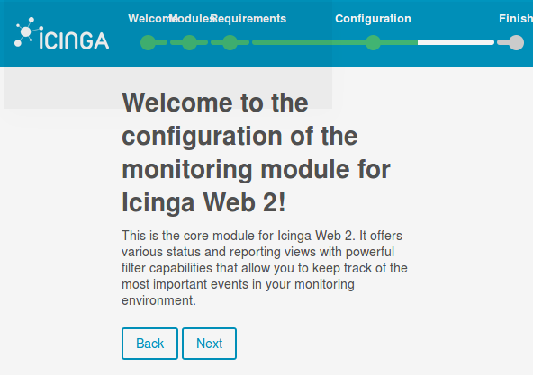
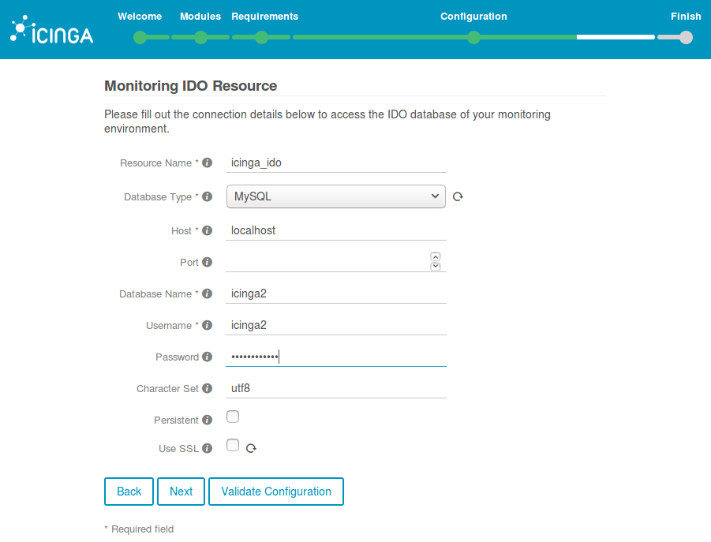

### How to install icinga2-director (on Virtualbox with Vagrant)
**CAUTION. This is experimental. For educational purposes only.**
**Please know what you do and don't blame anyone else but yourself when stuff breaks!**

## Purpose
Installing Icinga2 Director proved to be quite a challenge. I tried to automate it as much as possible.

## Virtual Machine
The VM is a Virtualbox instance provisioned by Vagrant. So you need to install https://www.virtualbox.org/ and https://www.vagrantup.com/
Or, you can read trought the code and see what things need to be done to setup Icinga2 Director.

## Other Documentation
The docs I used as a starting point: https://github.com/Icinga/icingaweb2-module-director/blob/master/doc/02-Installation.md,
http://www.2daygeek.com/install-icinga2-network-monitoring-tool-on-ubuntu-debian-mint/

## Hetzner
There is special network configuation in this VM, that has to do with hosting at Hetzner.de. See http://wiki.hetzner.de/index.php/Netzkonfiguration_Debian/en
and http://wiki.hetzner.de/index.php/KVM_mit_Nutzung_aller_IPs_-_the_easy_way/en
However, you can just ignore that and configure your network as you see fit.

## Preparation I
Run the script `./00_install_plugins.sh` once before you run `vagrant up`. It installs two plugins that are useful.

## Preparation II
Make sure you modify the Vagrantfile accordingly. 1024 MB RAM is the minimum.
At the least supply a hostname.
Also read the other 'install-*' scripts, and fill in the necessary values (email address and such).
Please do edit the 'conf.network' file to suit your needs. The 'conf.software' file shouldn't need modification.

## vagrant up
The command `vagrant up` should give you a running VM with icinga2, icingaweb2, icinga2-ido-mysql and icinga2-director.

## passwords
During install, a `vagrant reload` will occur.
Just before that, the passwords are shown.
There's about 20-30 lines after the reload, so scroll a bit back. You will see something like this:

```
==> default: Now restart your Icinga 2 daemon to finish the installation!
==> default: Enabling feature ido-mysql. Make sure to restart Icinga 2 for these changes to take effect.
==> default: Please note token and passwords:
==> default: The newly generated setup token is: 7c45f63648a9ab5e
==> default: mysql root password = iDsGs4KQvniBZjio83mwkRyd65fnmDMiZ
==> default: API user: 'director' password: ST4S1vCEdBYVye6sG0hS36JZkEhzWGjO4
==> default: director database: 'icinga2_director' password: xtTD0lg3tP42Jkr7YQzdSqpvPKpG0YcaT
==> default: Please also note the IDO database and password:
==> default: /**
==> default:  * The db_ido_mysql library implements IDO functionality
==> default:  * for MySQL.
==> default:  */
==> default:
==> default: library "db_ido_mysql"
==> default:
==> default: object IdoMysqlConnection "ido-mysql" {
==> default:   user = "icinga2",
==> default:   password = "WScxhK8PF7X7",
==> default:   host = "localhost",
==> default:   database = "icinga2"
==> default: }
==> default: Running provisioner: reload...
{ after this another 20 - 30 lines...}
```

## Configure Icinga2, Icingaweb2, Icinga2 IDO, and Icinga Director in 28 easy steps!

1. You should now be able to open https://YOURHOSTNAME.FQDN/icingaweb2/setup
    Grab the `token`, in this case `7c45f63648a9ab5e`, paste it and press next.

    

2. Make sure you select 'Director' and 'Monitoring' modules.

    

3. Everything should be green now, except two items that require postgresql.

    

4. Just accept the defaults and press next.

    

5. Fill in the name of the database (`icingaweb2`), the user (`icingaweb2`) and some random password. You won't need this later. Also use `utf8` as character set.

    

6. Click on `Validate configuration`. It should validate.

    

7. Fill in username: `root` and the password, in this case `iDsGs4KQvniBZjio83mwkRyd65fnmDMiZ`.

    

8. Just click next.

    

9. Fill in a user and password that you will use to access the webinterface. It can be any username that you like, and any password that you like. You need it every time you want to login to Icinga.

    

10. Just click next.

    

11. This is an overview of your configuration choices. Click next.

    

    **Configure Icingaweb2 Monitoring Module (IDO)**

12. Just click next.

    

13. Just click next.

    

14. Configure IDO. Fill in the name of the database (`icinga2`), the user (`icinga2`) and the password, in this case `WScxhK8PF7X7`. You won't need this later, but you can find it in `/etc/icinga2/features-enabled/ido-mysql.conf`. Also use `utf8` as character set.

    

15. Click on `Validate configuration`. It should validate.

    

16. Choose `Icinga 2 API` as your Transport Type. Choose 127.0.0.1 as your host, assuming you are running everything on the same machine. The API username is `director` and the password is in this case `ST4S1vCEdBYVye6sG0hS36JZkEhzWGjO4`.

    

17. Just click next, I suppose.

    

18. This is an overview of your configuration choices. Click next.

    

19. Congratulations! Click on `Login to Icinga Web 2`

    

20. Login with the user and password you created in step 9.

    

    **Configure Icinga2 Director**

21. Click on `Icinga Director` on the left side menu. You will go to `Kickstart` but there will be no suitable resource available. You have to create that. Click on `Configuration -> Application -> Resources`.

    

22. Click on `Add Resource`

    

23. The `Resource Name`, `Database Name` and `Username` should be `icinga2_director`. The `Password` in this case is `xtTD0lg3tP42Jkr7YQzdSqpvPKpG0YcaT`. You won't need this later. Also use `utf8` as character set.

    

24. Click on `Validate configuration`. It should validate.

    

25. Click next, and you will see the newly created icinga2_director resource.

    

26. Click on `Icinga Director` on the left side menu. You will go to `Kickstart`, and you will be able to select a suitable resource: `icinga2_director`. Click on `Create databse schema`

    

27. FIll in the `Endpoint Name` and `Icinga Host` with your fully qualified domain name. Fill in the `API user`, in this case `director` and the password, in this case `ST4S1vCEdBYVye6sG0hS36JZkEhzWGjO4`. You won't need this later, but you can find it in `/etc/icinga2/conf.d/api-users.conf`

    

28. You can now start adding hosts, services and such to Icinga2. How exactly will be left as an exercise for the reader.

    
